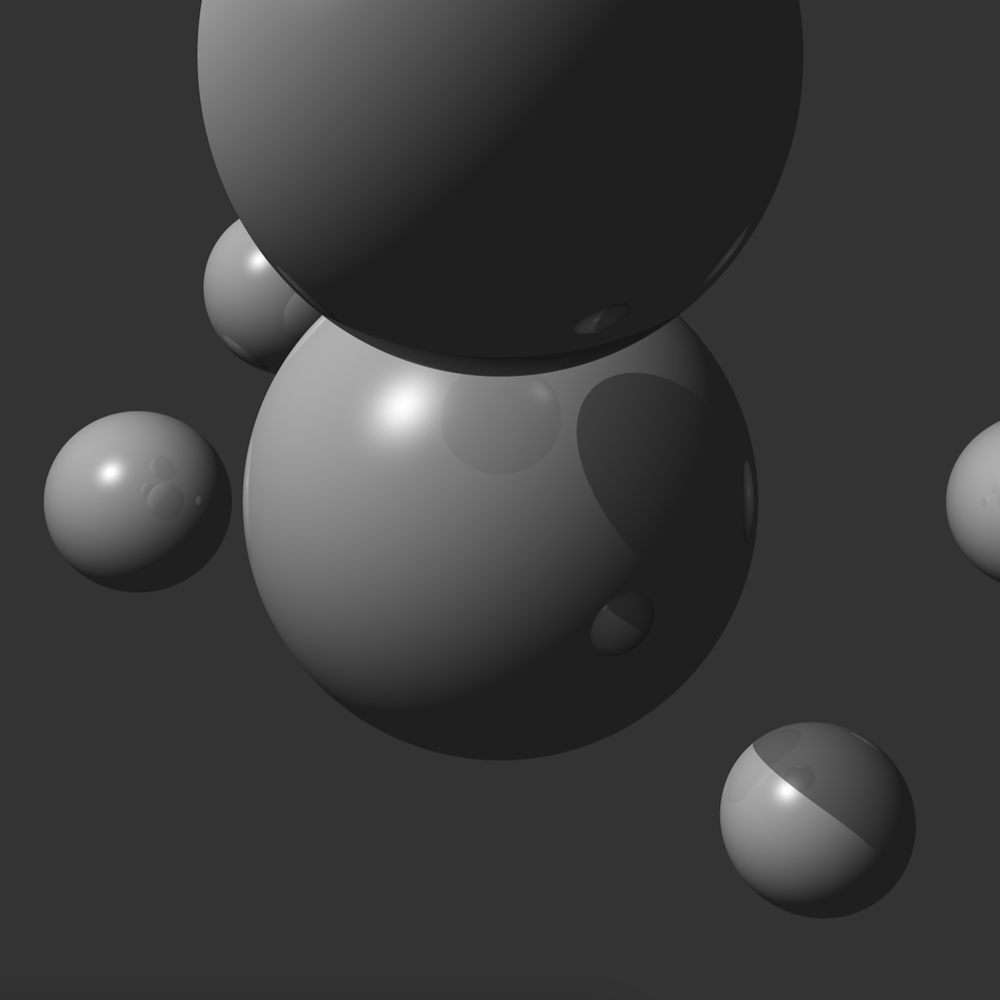
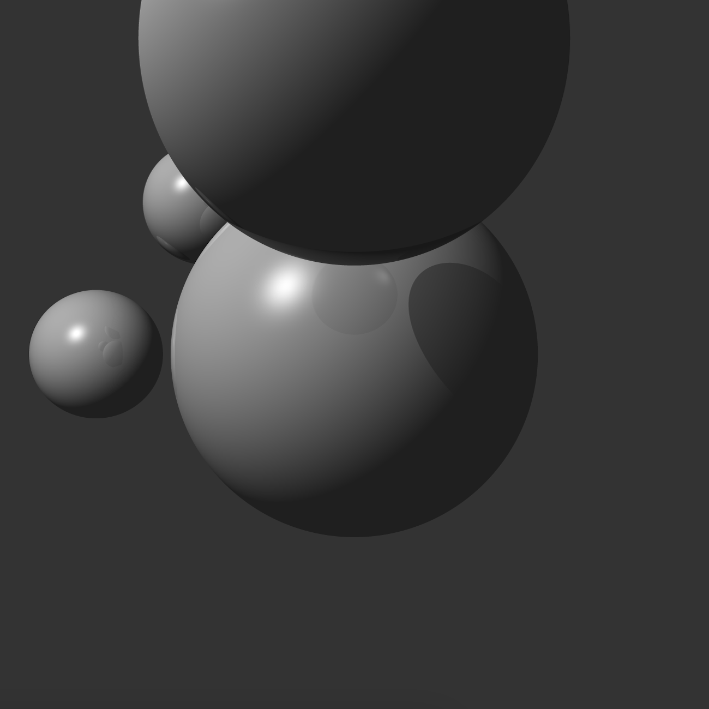

# BVH 기반 레이 트레이싱 프로젝트

이 프로젝트는 Bounding Volume Hierarchy (BVH)를 사용하여 최적화된 레이 트레이싱 렌더러를 구현합니다. 
BabylonJS를 기반으로 하며, WebGL 셰이더를 사용하여 GPU에서 레이 트레이싱을 수행합니다.

<br>

## 프로젝트 설정 및 실행 방법
1. 필요한 종속성 설치
    ```
   npm install
    ```
2. 개발 서버 실행
   ```
   npm run start
   ```
3. 브라우저에서 `http://localhost:9000` (또는 터미널에 표시된 URL)을 열어 프로젝트를 확인합니다.

<br>

## 프로젝트 미리보기
|              BVH 미사용               |              BVH 사용               |
|:----------------------------------:|:---------------------------------:|
|  |  |

### 성능 테스트 결과 (10초 동안 측정)
|측정 항목|BVH 미사용|BVH 사용|
|:------|:-------:|:-----:|
|Frames|124|46|
|Average FPS|12.39|4.57|
|Average Frame Time|0.39 ms|0.60 ms|
|Average Render Time|0.22 ms|0.35 ms|
|Average Active Meshes Evaluation Time|0.07 ms|0.10 ms|
|Draw Calls|1|1|

현재 구현에서는 BVH를 사용한 경우가 사용하지 않은 경우보다 성능이 낮음을 알 수 있습니다. 
이는 다음과 같은 이유로 설명될 수 있습니다:

1. **적은 수의 객체**: 현재 장면에는 비교적 적은 수의 구체만 포함되어 있습니다. BVH는 많은 수의 객체가 있을 때 더 효과적이며, 객체 수가 적을 때는 오히려 오버헤드가 될 수 있습니다.
2. **최적화 여지**: 현재 BVH 구현은 기본적인 형태로, 추가적인 최적화가 필요할 수 있습니다. 예를 들어, 트리 구조의 깊이 조절, 리프 노드의 크기 최적화 등이 성능 향상에 도움될 수 있습니다.
3. **텍스처 접근 오버헤드**: BVH 데이터를 텍스처로 전달하고 GPU에서 이를 읽는 과정이 추가되어, 간단한 장면에서는 이 오버헤드가 성능 저하를 일으킬 수 있습니다.

<br>

## 주요 구현 내용
### AABB (Axis-Aligned Bounding Box)
AABB는 `AABB.ts`에서 구현되었습니다:

- 3D 공간에서 축에 정렬된 경계 상자를 표현합니다.
- 최소점(min)과 최대점(max)으로 정의됩니다.
- 충돌 검사와 BVH 구축에 사용됩니다.

### BVH (Bounding Volume Hierarchy)
BVH는 `BVHBuilder.ts`와 `BVHNode.ts`에서 구현되었습니다. 주요 특징은 다음과 같습니다:

- SAH (Surface Area Heuristic)를 사용하여 최적의 분할 지점을 찾습니다.
- 재귀적으로 BVH 트리를 구축합니다.
- 각 BVH 노드는 다음 정보를 포함합니다:
  - `aabb`: Axis-Aligned Bounding Box
  - `left`: 왼쪽 자식 노드
  - `right`: 오른쪽 자식 노드
  - `primitiveIndices`: 프리미티브(구체) 인덱스 배열
- 노드당 최대 프리미티브 수를 제한하고 최대 깊이를 설정하여 트리의 깊이를 조절합니다.

### BVH 평탄화
`BVHFlattener.ts`에서 구현된 BVH 평탄화는 다음과 같은 특징을 가집니다:

- 트리 구조를 1차원 배열로 변환합니다.
- 각 노드는 8개의 float 값으로 표현됩니다. (AABB min/max, 자식 노드 정보 등)
- 평탄화된 구조는 GPU에서 효율적으로 순회할 수 있습니다.

### Ray Tracing
레이 트레이싱은 주로 `raytracer.fragment.glsl`에서 구현되었습니다:

- 카메라 레이 생성
- BVH 순회를 통한 교차 테스트
- 그림자 및 반사 계산
- 간단한 조명 모델 적용

### 렌더링 파이프라인
`Raytracer.ts`에서 관리되는 렌더링 파이프라인의 주요 특징은 다음과 같습니다:

- BabylonJS의 ShaderMaterial을 사용하여 커스텀 셰이더 적용
- 평탄화된 BVH 데이터를 Texture로 GPU에 전달
- 카메라 및 장면 정보를 셰이더에 전달

<br>

## 성능 최적화

- BVH를 사용하여 레이-오브젝트 교차 테스트 최적화
- GPU에서 병렬 처리를 위한 셰이더 구현
- 텍스처를 이용한 효율적인 BVH 데이터 전송

<br>

## 향후 개선 사항

- 구체 렌더링의 정확도 향상: 현재 일부 구체가 제대로 표시되지 않는 문제 해결
- 더 복잡한 지오메트리 지원 (예: 삼각형 메시)
- BVH 구축 알고리즘 개선을 통한 성능 향상